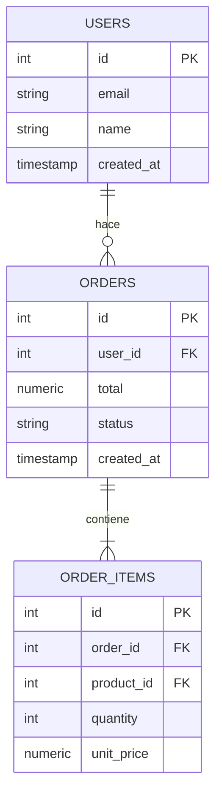

# 🗄️ Agente Base de Datos — PostgreSQL

> Leé este archivo cuando diseñes esquemas, escribas queries o trabajes con migraciones

## Motor único
- **PostgreSQL 16+** para todo — relacional, JSON, búsqueda full-text
- Acceso desde código siempre via ORM (Prisma / SQLAlchemy / Spring Data JPA)
- Nunca SQL crudo en el código de aplicación, salvo queries muy complejas que el ORM no pueda
- Cliente local recomendado: **DBeaver** (gratuito, Windows-friendly)

---

## Diseño de esquemas — reglas

### Nombrado
```sql
-- Tablas: snake_case, plural
CREATE TABLE users ( ... );
CREATE TABLE order_items ( ... );

-- Columnas: snake_case
first_name, created_at, is_active

-- PKs: siempre llamadas "id"
-- FKs: tabla_id  →  user_id, product_id, order_id
```

### Columnas estándar en TODA tabla
```sql
id          SERIAL PRIMARY KEY,         -- o BIGSERIAL para tablas grandes
created_at  TIMESTAMP DEFAULT NOW(),
updated_at  TIMESTAMP DEFAULT NOW()
-- Si tiene borrado lógico:
deleted_at  TIMESTAMP NULL              -- NULL = activo, fecha = eliminado
```

### Tipos de datos correctos
```sql
-- ✅ Usar
id            SERIAL / BIGSERIAL        -- PKs autoincrement
user_id       INTEGER REFERENCES users(id)
name          VARCHAR(100)              -- longitud razonable, no TEXT para todo
description   TEXT                      -- contenido largo sin límite conocido
price         NUMERIC(10, 2)            -- dinero: NUNCA FLOAT
is_active     BOOLEAN DEFAULT TRUE
created_at    TIMESTAMP WITH TIME ZONE  -- siempre con zona horaria
data          JSONB                     -- JSON con índice, más rápido que JSON

-- ❌ Evitar
price FLOAT          -- pérdida de precisión en decimales
status VARCHAR(50)   -- usar ENUM o tabla de referencia
id UUID              -- más complejo, solo si realmente necesitás IDs no predecibles
```

---

## Índices — cuándo y cómo

```sql
-- Regla: índice en todo campo que aparezca en WHERE, JOIN u ORDER BY frecuentes

-- FK siempre con índice (PostgreSQL NO los crea automáticamente)
CREATE INDEX idx_orders_user_id ON orders(user_id);

-- Campo de búsqueda frecuente
CREATE INDEX idx_users_email ON users(email);

-- Búsqueda por rango de fechas
CREATE INDEX idx_orders_created_at ON orders(created_at DESC);

-- Índice compuesto (cuando siempre filtrás por los dos juntos)
CREATE INDEX idx_products_category_active ON products(category_id, is_active);

-- Full-text search (búsqueda de texto)
CREATE INDEX idx_products_name_fts ON products USING gin(to_tsvector('spanish', name));
```

---

## Queries bien escritas

### Paginación correcta (no OFFSET para tablas grandes)
```sql
-- ✅ Cursor-based (eficiente)
SELECT * FROM orders
WHERE id > :last_id AND user_id = :user_id
ORDER BY id ASC
LIMIT 20;

-- ⚠️ OFFSET (ok para tablas chicas, lento en millones de registros)
SELECT * FROM products
ORDER BY created_at DESC
LIMIT 20 OFFSET 40;
```

### Evitar N+1 — siempre JOIN o include
```sql
-- ✅ Un solo query con JOIN
SELECT u.name, COUNT(o.id) as total_orders
FROM users u
LEFT JOIN orders o ON o.user_id = u.id
GROUP BY u.id, u.name;

-- ❌ N+1: un query por cada usuario
SELECT * FROM users;
-- luego para cada usuario: SELECT * FROM orders WHERE user_id = ?
```

### Transacciones para operaciones múltiples
```sql
BEGIN;
  UPDATE accounts SET balance = balance - 100 WHERE id = 1;
  UPDATE accounts SET balance = balance + 100 WHERE id = 2;
  INSERT INTO transactions(from_id, to_id, amount) VALUES (1, 2, 100);
COMMIT;
-- Si algo falla, ROLLBACK automático
```

---

## Diagrama ER para proyectos universitarios

Siempre incluir en la documentación. Formato Mermaid para el README:

```markdown

```

---

## Migraciones — flujo de trabajo en equipo

```bash
# Con Prisma (Node.js)
npx prisma migrate dev --name agregar_campo_telefono   # crea migración
npx prisma migrate deploy                               # aplica en prod

# Con Alembic (Python/FastAPI)
alembic revision --autogenerate -m "agregar_campo_telefono"
alembic upgrade head

# Con Spring Boot (Java) — Flyway
# Crear archivo: resources/db/migration/V2__agregar_campo_telefono.sql
# Spring lo aplica automático al iniciar
```

### Reglas de migraciones en equipo
1. **Nunca** modificar una migración ya commiteada
2. Siempre crear una nueva migración para cada cambio
3. Nombres descriptivos: `agregar_tabla_productos`, `renombrar_columna_precio`
4. Revisar el SQL generado antes de aplicar en producción

---

## Lo que SIEMPRE debo recordarme
- `NUMERIC` para dinero, nunca `FLOAT`
- Índice manual en todas las FKs
- `TIMESTAMP WITH TIME ZONE` en vez de `TIMESTAMP`
- Borrado lógico (`deleted_at`) para tablas importantes — no borrar registros reales
- Backup antes de cualquier migración destructiva en producción
- Nunca conectar con usuario `postgres` (superusuario) desde la app — crear usuario específico
