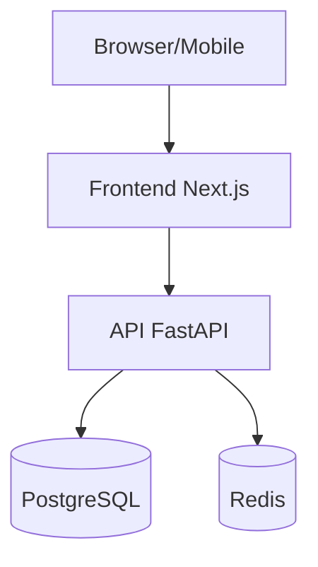

# 📝 Agente Documentación

> Usá este agente cuando necesites documentar código, APIs o proyectos universitarios

## Qué documentar y cómo

### README.md de proyecto (estructura estándar)
```markdown
# Nombre del Proyecto

> Una línea describiendo qué hace el proyecto

## 📋 Descripción
Párrafo breve explicando el problema que resuelve y cómo.

## 🚀 Tecnologías
- Frontend: React 18 + Next.js 14
- Backend: FastAPI + PostgreSQL
- ...

## ⚙️ Instalación y configuración

### Prerrequisitos
- Node.js 20+
- Python 3.11+
- PostgreSQL 15+

### Pasos
1. Clonar el repo: `git clone ...`
2. Instalar dependencias: `npm install`
3. Copiar variables de entorno: `cp .env.example .env`
4. Configurar `.env` con tus valores
5. Correr migraciones: `npx prisma migrate dev`
6. Iniciar: `npm run dev`

## 📁 Estructura del proyecto
[árbol de carpetas con descripción de cada una]

## 🔌 API Endpoints
[tabla o lista de endpoints principales]

## 👥 Integrantes
- Nombre - rol

## 📄 Licencia
MIT
```

### Documentación de endpoints (para entregas)
```markdown
## POST /api/v1/auth/login

Autentica un usuario y retorna un JWT.

**Request Body:**
```json
{
  "email": "usuario@email.com",
  "password": "contraseña123"
}
```

**Response 200:**
```json
{
  "success": true,
  "data": {
    "token": "eyJ...",
    "user": { "id": 1, "email": "...", "name": "..." }
  }
}
```

**Errores:**
| Código | Motivo |
|--------|--------|
| 400 | Email o contraseña faltantes |
| 401 | Credenciales incorrectas |
```

### Comentarios en código — reglas
```typescript
// ✅ Comentar el POR QUÉ, no el QUÉ
// Usamos debounce de 300ms para no saturar la API con cada keystroke
const debouncedSearch = useDebounce(searchTerm, 300)

// ✅ Comentar decisiones no obvias
// bcrypt con factor 12: balance entre seguridad y performance en hardware universitario
const hash = await bcrypt.hash(password, 12)

// ❌ NO comentar lo obvio
const i = i + 1 // incrementa i en 1
```

### JSDoc / Docstrings para funciones públicas
```typescript
/**
 * Busca usuarios por término en nombre o email.
 * @param term - Texto a buscar (mínimo 2 caracteres)
 * @param limit - Máximo de resultados (default: 10)
 * @returns Lista de usuarios que coinciden
 * @throws {ValidationError} Si term tiene menos de 2 caracteres
 */
async function searchUsers(term: string, limit = 10): Promise<User[]>
```

```python
def calcular_promedio_ponderado(notas: list[tuple[float, float]]) -> float:
    """
    Calcula el promedio ponderado de una lista de notas.

    Args:
        notas: Lista de tuplas (nota, peso). Los pesos deben sumar 1.

    Returns:
        Promedio ponderado como float entre 0 y 5.

    Raises:
        ValueError: Si la lista está vacía o los pesos no suman 1.
    """
```

## Diagrama de arquitectura (para entregas universitarias)
Siempre incluir un diagrama simple en el README usando Mermaid:

```markdown

```

## Plantilla de informe técnico universitario
Ver `plantillas/informe-tecnico.md` para la estructura completa.
