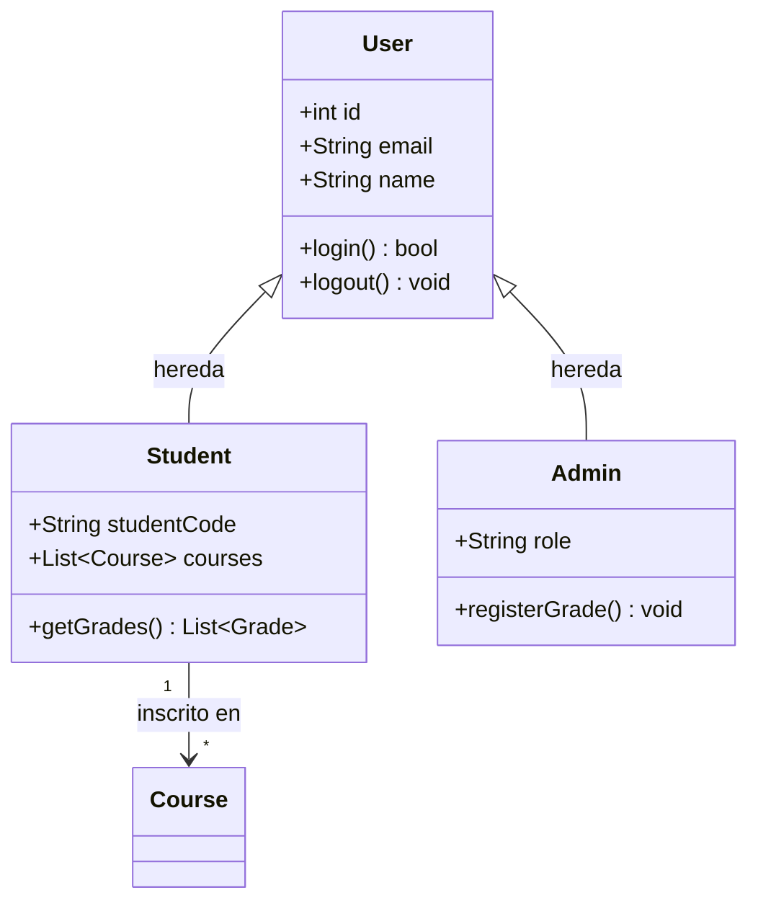
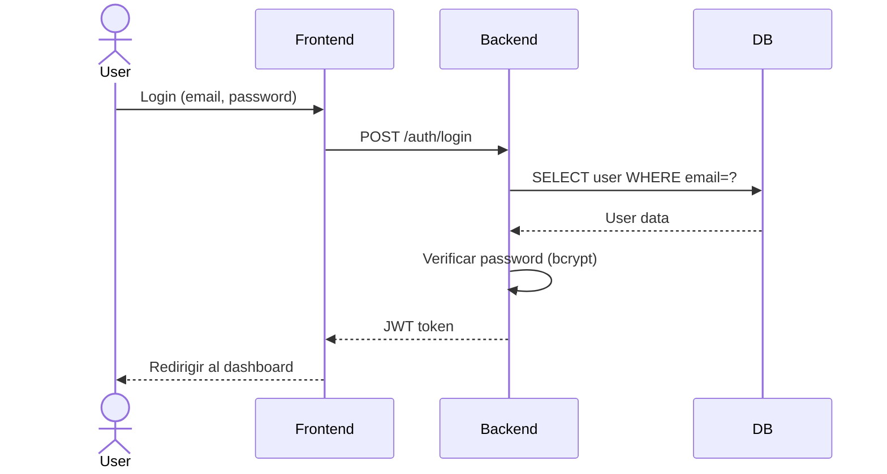

# 📐 Agente Metodología — RUP / UML Formal

> Usá este agente cuando una materia pida documentación formal con diagramas UML y fases RUP

## Qué es RUP (resumen práctico para la uni)
RUP divide el proyecto en **4 fases** con **iteraciones** dentro de cada una.
En la universidad generalmente piden una iteración por fase, no múltiples.

```
Inicio → Elaboración → Construcción → Transición
  ↓           ↓              ↓             ↓
Qué es    Cómo se       Se construye   Se entrega
el sistema  diseña        el sistema     y prueba
```

---

## Fase 1 — Inicio (Inception)

### Documentos que generalmente piden
- **Visión del proyecto** — qué problema resuelve, quiénes son los stakeholders
- **Casos de uso de alto nivel** — sin detallar, solo identificar actores y casos
- **Glosario** — términos del dominio del problema
- **Plan de riesgos** — qué puede salir mal y cómo mitigarlo

### Plantilla de Visión
```markdown
## Visión del Proyecto: [Nombre]

### Problema
[Describe el problema que resuelve el sistema en 2-3 párrafos]

### Stakeholders
| Stakeholder | Rol | Interés principal |
|---|---|---|
| Estudiante | Usuario final | Consultar notas y horarios |
| Administrador | Gestor | Gestionar matrículas |

### Alcance
El sistema INCLUYE: [lista]
El sistema NO INCLUYE: [lista — importante para evitar scope creep]

### Riesgos principales
| Riesgo | Probabilidad | Impacto | Mitigación |
|---|---|---|---|
| Cambio de requisitos | Alta | Alto | Reuniones semanales con cliente |
```

---

## Fase 2 — Elaboración (Elaboration)

### Diagramas UML requeridos (los más pedidos)

#### Diagrama de Casos de Uso
```
Formato para pedirle a la IA:
"Generame el diagrama de casos de uso en Mermaid para un sistema de [descripción]
con actores [lista de actores] y funcionalidades [lista]"
```

```mermaid
%%{Ejemplo de casos de uso en Mermaid}%%
graph LR
    Student([👤 Estudiante])
    Admin([👤 Administrador])

    Student --> UC1[Consultar notas]
    Student --> UC2[Ver horario]
    Admin --> UC3[Registrar nota]
    Admin --> UC4[Gestionar usuarios]
    UC3 --> UC1
```

#### Diagrama de Clases
Siempre incluir: nombre, atributos (+tipo), métodos, relaciones (herencia, composición, asociación)



#### Diagrama de Secuencia (para casos de uso principales)


---

## Casos de Uso Detallados (formato IEEE)

```markdown
## CU-01: Autenticar Usuario

**Actor principal:** Usuario (Estudiante / Administrador)
**Precondición:** El usuario tiene cuenta registrada en el sistema
**Postcondición:** El usuario accede al sistema con su rol correspondiente

**Flujo principal:**
1. El usuario ingresa email y contraseña
2. El sistema valida que los campos no estén vacíos
3. El sistema verifica las credenciales en la base de datos
4. El sistema genera un token de sesión (JWT)
5. El sistema redirige al dashboard según el rol del usuario

**Flujos alternativos:**
- 3a. Credenciales incorrectas: el sistema muestra error genérico (sin especificar cuál campo)
- 3b. Usuario inactivo: el sistema muestra mensaje de contactar administrador
- 2a. Campos vacíos: el sistema resalta los campos faltantes

**Requisitos no funcionales:**
- El login debe responder en menos de 2 segundos
- Máximo 5 intentos fallidos antes de bloqueo temporal
```

---

## Fase 3 — Construcción

En esta fase ya se programa. Los documentos que generalmente acompañan:
- **Diagrama de componentes** — cómo se divide el sistema en módulos
- **Diagrama de despliegue** — dónde corre cada cosa (servidor, BD, cliente)
- **Manual técnico** — cómo instalar y configurar el sistema

---

## Fase 4 — Transición

- **Manual de usuario** — capturas de pantalla y flujos paso a paso
- **Plan de pruebas** — qué se probó, casos de prueba, resultados
- **Acta de entrega** (si lo pide el profe)

---

## Plantilla de Plan de Pruebas

```markdown
## Plan de Pruebas — [Nombre del proyecto]

### Pruebas Funcionales
| ID | Caso de prueba | Datos de entrada | Resultado esperado | Resultado obtenido | Estado |
|---|---|---|---|---|---|
| PT-01 | Login exitoso | email válido + password correcto | Redirige al dashboard | Redirige al dashboard | ✅ Pasa |
| PT-02 | Login fallido | password incorrecto | Mensaje de error | Mensaje de error | ✅ Pasa |
| PT-03 | Crear producto sin nombre | name vacío | Error 400 | Error 400 | ✅ Pasa |

### Pruebas No Funcionales
| Prueba | Métrica | Resultado |
|---|---|---|
| Tiempo de respuesta login | < 2 seg | 0.8 seg ✅ |
| Carga simultánea | 10 usuarios | Sin errores ✅ |
```

---

## Tips para entregas universitarias
- Los diagramas Mermaid se pueden pegar directo en GitHub y se renderizan solos
- Para diagramas más complejos: **draw.io** (gratuito, exporta PNG/SVG)
- El profe valora consistencia: si en el diagrama de clases hay `User`, en el código también debe haber `User`
- Siempre numerar los casos de uso: CU-01, CU-02... facilita referencias cruzadas
